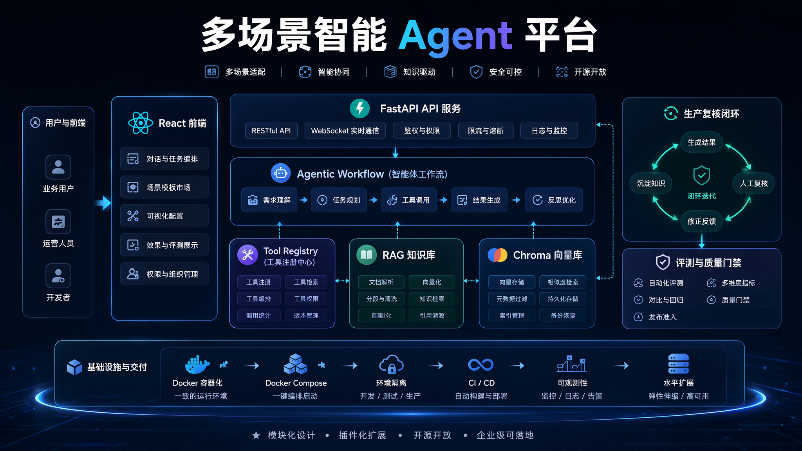
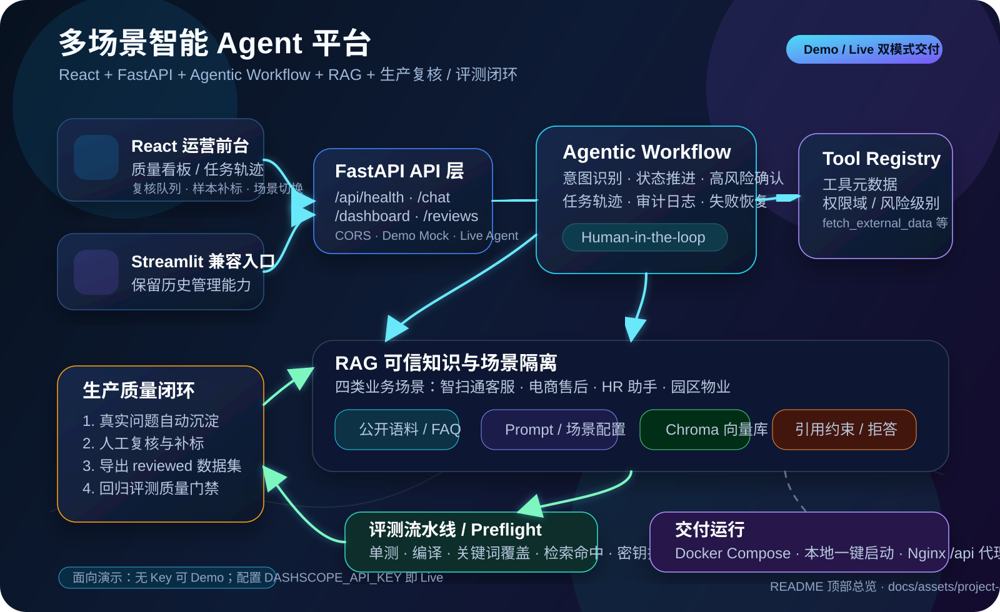

<p align="center">
  
</p>

<p align="center">
  
</p>

# 多场景智能Agent平台 🤖
> 基于 React + FastAPI + LangChain/LangGraph Agent + RAG + 生产质量闭环的**多场景智能 Agent 平台**，原生支持扫地机器人客服、电商售后、HR助手、园区物业等业务场景；支持 Demo/Live 双模式、工具治理、人机确认、任务轨迹、复核补标、评测质量门禁与 Docker 化交付。

---
# 使用必看
1. 请务必安装好相关配置环境；真实高德 Web 服务 API Key 请通过 `GAODE_API_KEY` 环境变量配置，不要写入仓库。
2. 管理员账号密码请通过 `ADMIN_USER` / `ADMIN_PWD` 环境变量配置，用于知识库在线上传与场景管理。
3. 多场景核心配置文件为`config/scenes.yml`，可自由扩展自定义业务场景。
4. 本项目需配置阿里云 DashScope API Key 方可正常使用大模型与向量化能力。

---

## 📖 项目简介
**多场景智能 Agent 平台**是一款面向企业客服、运营复核和评测闭环的现代化 Agent 应用。项目已从原有单一 Streamlit Demo 升级为 **React 运营前台 + FastAPI API 层 + LangChain/LangGraph Agent + RAG 可信知识库 + 生产质量闭环** 的工程化原型，同时保留 Streamlit 作为兼容入口。

- **现代化前端体验**：独立 Vite + React + TypeScript 前端，集成场景切换、Chat、质量看板、任务轨迹、人工复核、样本补标和导出入口
- **FastAPI 后端 API**：提供 `/api/health`、`/api/chat`、`/api/dashboard`、`/api/reviews`、`/api/samples` 等接口，支持前后端解耦联调
- **Demo / Live 双模式**：未配置 `DASHSCOPE_API_KEY` 时可稳定演示；配置后切换到真实模型、RAG 与工具调用链路
- **Agentic Workflow**：支持任务状态推进、工具审计、高风险动作识别、人机确认和可回放任务轨迹
- **Tool Registry 工具治理**：以工具元数据、权限域、风险等级和审计策略控制工具启用与确认逻辑
- **RAG 可信引用**：按场景隔离知识库、Prompt 与向量集合，要求关键结论可追溯，证据不足时拒答
- **生产运营闭环**：真实问题自动沉淀为复核项和评测样本，支持人工补标、reviewed 数据集导出和回归评测
- **质量门禁与交付**：内置单测、编译检查、关键词覆盖、检索命中、密钥扫描、Docker Compose 和本地一键启动脚本

---

## ✨ 核心特性

| 特性 | 说明 |
|------|------|
| **多场景支持** | 配置化定义业务场景，原生支持智扫通客服、电商售后、HR助手、园区物业 |
| **前端体验** | React 运营前台负责 Chat、质量看板、任务轨迹、人工复核、样本补标；Streamlit 保留为兼容入口 |
| **API 层** | FastAPI 提供健康检查、场景配置、对话、看板、复核队列、样本管理和 reviewed 导出接口 |
| **Agent 框架** | LangChain ReAct Agent + LangGraph，叠加 Agentic Workflow、任务状态推进和高风险确认 |
| **工具治理** | Tool Registry 统一描述工具权限域、参数 Schema、风险等级和审计策略 |
| **RAG 可信知识库** | Chroma 本地持久化，多场景集合隔离；回答要求引用证据，证据不足时拒答 |
| **生产质量闭环** | 运行轨迹 → 人工复核 → 样本补标 → reviewed 数据集导出 → 评测质量门禁 |
| **Demo / Live 双模式** | 无模型 Key 可稳定演示；配置 `DASHSCOPE_API_KEY` 后调用真实模型、Embedding 和工具链路 |
| **交付方式** | 支持本地一键启动、Docker Compose、Nginx `/api` 反向代理和 preflight 收口检查 |
| **安全约束** | `.env` 管理敏感配置，内置 token-like 密钥扫描，避免 Key 写入仓库 |

---

## 🏗 系统架构

README 顶部已放置两张展示图：

1. `docs/assets/project-cover-image2.png`：使用 image2 模型生成的项目展示封面图。
2. `docs/assets/project-architecture-flow.svg`：用于准确表达真实工程链路的全局架构与流程图，覆盖 React 前台、FastAPI、Agentic Workflow、Tool Registry、RAG、Chroma、生产复核、评测门禁和 Docker 交付。

核心链路可以概括为：

```text
React / Streamlit 入口
  → FastAPI API 层
  → Agentic Workflow + Tool Registry
  → RAG 可信知识库 / 外部工具
  → 任务轨迹与审计日志
  → 人工复核与样本补标
  → reviewed 数据集与评测质量门禁
  → Demo / Live / Docker Compose 交付
```

---

## 📂 目录结构

```
Intelligent-Customer-Service/
├── frontend/                     # Vite + React + TypeScript 运营前台
│   ├── src/components/           # Hero、Chat、质量看板、轨迹、复核、样本管理
│   ├── src/api/client.ts         # FastAPI client，支持 mock / 同源 / 自定义 API_BASE
│   ├── Dockerfile                # 前端 Nginx 静态交付镜像
│   └── nginx.conf                # SPA fallback 与 /api 反向代理
├── api/
│   └── server.py                 # FastAPI API 层：health/chat/dashboard/reviews/samples
├── agent/
│   ├── react_agent.py            # 多场景 ReAct Agent 核心逻辑
│   └── tools/                    # 工具函数、中间件和工具调用治理
├── rag/                          # RAG 检索、引用格式化和 Chroma 向量库管理
├── utils/                        # Agentic Workflow、Tool Registry、审计、任务存储、生产闭环
├── eval/                         # seed/reviewed 数据集、评测脚本和质量报告
├── tests/                        # 数据、评测、API Demo Mode、生产闭环等单测
├── scripts/                      # 数据采集、评测流水线、preflight、本地一键启动
├── docs/
│   ├── DELIVERY.md               # 本地 / Docker / Demo-Live 交付说明
│   └── assets/                   # README 顶部展示图和全局架构流程图
├── app.py                        # Streamlit 兼容入口
├── config/                       # 场景、模型、RAG、Chroma、Prompt 配置
├── prompts/                      # 多场景系统 Prompt / RAG Prompt / Report Prompt
├── data/                         # 场景知识库、采集语料和外部数据
├── Dockerfile.api                # FastAPI 后端镜像
├── docker-compose.yml            # 前后端一体化演示环境
├── .env.example                  # 环境变量样例，真实 Key 不入库
└── requirements.txt              # Python 依赖
```

---

## 📦 环境依赖

### Python 版本

建议使用 **Python 3.10+**（代码中使用了 `tuple[str, str]` 等 3.10+ 类型注解语法）。

### 主要依赖包

| 包名 | 用途 |
|------|------|
| `streamlit` | 前端 Web 框架 |
| `langchain` / `langchain-core` | Agent / Chain / Tool 框架与核心抽象（当前固定到 1.3.11 / 1.4.8） |
| `langchain-community` | 通义千问、DashScope Embedding 等集成 |
| `langgraph` / `langgraph-prebuilt` | 基于图的 Agent 执行引擎（当前固定到 1.2.6 / 1.1.0） |
| `langchain-chroma` | LangChain 与 Chroma 向量库集成 |
| `chromadb` | Chroma 向量数据库 |
| `dashscope` | 阿里云 DashScope SDK（Embedding / LLM） |
| `pypdf` / `pypdf2` | PDF 文档加载 |
| `pyyaml` | YAML 配置文件解析 |

### 一键部署（推荐）

```bash
python -m pip install -r requirements.txt
```

---

## ⚙️ 配置说明

### 1. 阿里云 API Key

本项目使用阿里云通义千问大模型和 DashScope Embedding，需要配置系统环境变量：

```bash
# Windows
set DASHSCOPE_API_KEY=your_dashscope_api_key

# Linux/Mac
export DASHSCOPE_API_KEY=your_dashscope_api_key
```

> 可在 [阿里云百炼平台](https://bailian.console.aliyun.com/) 获取 API Key。

### 2. 高德地图 API Key

请通过环境变量配置高德地图 Web 服务 API Key，避免把真实密钥写入仓库：

```bash
export GAODE_API_KEY=your_gaode_api_key
export GAODE_BASE_URL=https://restapi.amap.com
export GAODE_TIMEOUT=5
```

`config/agent.yml` 仅保留占位符和默认非敏感配置：

```yaml
external_data_path: data/external/records.csv
gaodekey: your_gaode_api_key
gaode_base_url: https://restapi.amap.com
gaode_timeout: 5
```

> 可在 [高德开放平台](https://console.amap.com/) 申请 Web 服务类型的 API Key。

### 3. 多场景配置（核心）

编辑 `config/scenes.yml`，定义你的业务场景：

```yaml
# config/scenes.yml
scenes:
  # 场景1：智扫通客服（原有场景）
  - id: zhisaotong
    name: 智扫通客服
    description: 设备使用、故障排查、知识库检索智能客服
    collection_name: zhisaotong_knowledge_base
    data_path: data/zhisaotong
    public: true  # 普通用户可见
    tools:
      - rag_summarize
      - get_weather
      - get_user_location
      - get_user_id
      - get_current_month
      - fetch_external_data
      - fill_context_for_report

  # 场景2：电商售后客服
  - id: ecommerce
    name: 电商售后客服
    description: 订单查询、退换货、产品使用、保修政策智能客服
    collection_name: ecommerce_knowledge_base
    data_path: data/ecommerce
    public: true
    tools:
      - rag_summarize
      - get_user_id
      - fetch_external_data

  # 场景3：企业HR助手
  - id: hr
    name: 企业HR助手
    description: 员工入职、考勤、薪酬、团建、人事制度智能助手
    collection_name: hr_knowledge_base
    data_path: data/hr
    public: false  # 仅管理员可见
    tools:
      - rag_summarize
      - get_current_month
      - fetch_external_data

  # 场景4：园区物业客服
  - id: property
    name: 园区物业客服
    description: 业主报修、物业费、停车、园区公告智能客服
    collection_name: property_knowledge_base
    data_path: data/property
    public: true
    tools:
      - rag_summarize
      - get_weather
      - get_user_location
```

### 4. 模型配置

编辑 `config/rag.yml` 可调整所使用的模型：

```yaml
# config/rag.yml
chat_model_name: qwen3-max          # 对话大模型
embedding_model_name: text-embedding-v4  # 向量化模型
```

### 5. 向量库配置

编辑 `config/chroma.yml` 可调整 RAG 检索参数：

```yaml
# config/chroma.yml
collection_name: agent              # 默认集合（向后兼容）
persist_directory: chroma_db
k: 3                                # 检索返回的最相关文档数量
data_path: data                     # 默认数据目录（向后兼容）
md5_hex_store: md5.text            # 默认MD5文件（向后兼容）
allow_knowledge_file_type: ["txt", "pdf"]
chunk_size: 200                     # 文本分块大小
chunk_overlap: 20                   # 分块重叠长度
```

---

## 🚀 快速开始

### 1. 克隆项目

```bash
git clone https://github.com/soilder01/Intelligent-Customer-Service.git
cd Intelligent-Customer-Service
```

### 2. 安装依赖

```bash
python -m pip install -r requirements.txt
```

### 3. 配置 API Key

```bash
# 设置阿里云 DashScope API Key
export DASHSCOPE_API_KEY="your_dashscope_api_key"

# 设置高德地图 API Key
export GAODE_API_KEY="your_gaode_api_key"

# 可选：复制环境变量模板
cp .env.example .env
```

真实密钥只放在本地环境变量或 `.env`，不要提交到仓库。
### 4. 启动应用

```bash
streamlit run app.py
```

浏览器将自动打开 `http://localhost:8501`，即可开始使用多场景智能Agent平台。

---

## 💬 使用方式

### 场景切换
在侧边栏「选择场景」下拉框中，一键切换业务场景，切换后自动重新初始化Agent，清空对话历史。

### 产品咨询（以智扫通为例）
直接提问关于扫地机器人的使用、维护、故障排除等问题，Agent 会优先从当前场景知识库中检索相关资料进行回答：
```
用户：扫地机器人的滤网多久需要更换一次？
用户：扫拖一体机器人和扫地机器人有什么区别？
用户：扫地机器人吸力变弱了怎么办？
```

### 天气与定位查询（按需配置）
在支持天气/定位工具的场景中，Agent 可调用高德 API 获取实时信息：
```
用户：我现在所在城市今天的天气怎么样？
```

### 使用报告生成（按需配置）
在支持报告生成的场景中，Agent 会自动检测报告生成意图，切换到报告提示词，并调用外部数据生成 Markdown 格式的使用情况报告：
```
用户：帮我生成我的使用报告
用户：给我一份扫地机器人的使用分析和保养建议
```

### 管理员在线上传知识库
1. 在侧边栏登录管理员账号（默认读取 `ADMIN_USER` / `ADMIN_PWD`；未配置时为 `admin` / `change-me`）
2. 选择要管理的场景
3. 上传知识库文件（支持 .txt / .md / .pdf）
4. 系统自动MD5去重，加载到当前场景向量库，无需重启服务

---

## 🛠 工具列表

Agent 配备了以下 7 个工具，可在 `config/scenes.yml` 中按场景配置启用：

| 工具名 | 描述 |
|--------|------|
| `rag_summarize` | 从当前场景向量知识库中检索参考资料 |
| `get_weather` | 获取指定城市的实时天气（高德 API） |
| `get_user_location` | 通过 IP 获取用户所在城市（高德 API） |
| `get_user_id` | 获取当前用户 ID |
| `get_current_month` | 获取当前月份 |
| `fetch_external_data` | 从外部系统获取指定用户指定月份的使用记录 |
| `fill_context_for_report` | 触发报告模式，通知中间件切换为报告生成提示词 |

---

## 🔄 中间件机制

Agent 的三个中间件负责监控、日志和动态提示词切换：

```
monitor_tool         工具调用监控
  ├─ 记录每次工具调用的名称和参数
  ├─ 记录工具调用成功/失败状态
  └─ 检测 fill_context_for_report 调用，将 context["report"] 置为 True

log_before_model     模型调用前日志
  └─ 记录当前消息数量及最新消息内容

report_prompt_switch 动态提示词切换
  ├─ context["report"] == True  → 使用报告生成提示词
  └─ context["report"] == False → 使用主 ReAct 提示词
```

---

## 📋 日志说明

日志文件存放在 `logs/` 目录下，按天自动创建：

```
logs/
└── agent_20250101.log    # 格式：{name}_{YYYYMMDD}.log
```

日志格式：
```
2025-01-01 12:00:00,123 - agent - INFO - middleware.py:19 - [tool monitor]执行工具：get_weather
```

- **控制台**：输出 INFO 及以上级别日志
- **文件**：输出 DEBUG 及以上级别日志（更详细）

---

## 📚 知识库

### 场景级知识库
每个场景有独立的知识库目录（在 `config/scenes.yml` 中配置 `data_path`），支持 `.txt`、`.md` 和 `.pdf` 格式。

### 在线上传
管理员登录后，在前端上传文件，系统会：
1. 自动保存到当前场景的 `data_path` 目录
2. 计算文件MD5，校验是否已存在
3. 若不存在，自动分片并向量化存入当前场景的 Chroma 集合
4. 保存MD5记录，避免重复入库

### 全量加载
首次启动或需要全量重新加载时，系统会自动扫描当前场景的 `data_path` 目录，加载所有新文件。

---

## 🔮 后续优化方向

- 将向量数据库从 Chroma 替换为 Milvus / Qdrant（更适合生产级多场景部署）
- 地点、天气等功能完整迁移至高德 MCP 协议
- 增加用户身份认证与多用户会话隔离
- 支持更多文档格式（Word、Excel 等）
- 增加场景级Prompt在线编辑功能
- 增加知识库文件在线预览与删除功能

---

## 📄 许可证

本项目仅供学习与参考使用。
感谢黑马程序员开源免费项目、阿里云和高德地图等开放平台。
```

---

## 🧪 数据采集与评测种子集

为支持后续 RAG 与 Agentic Workflow 评估，项目已新增公开数据采集脚本：

```bash
python scripts/collect_public_knowledge.py
```

采集后的知识库数据会写入：

- `data/zhisaotong/public_knowledge_seed.txt`
- `data/ecommerce/public_knowledge_seed.txt`
- `data/hr/public_knowledge_seed.txt`
- `data/property/public_knowledge_seed.txt`

来源清单位于：

- `data/collected/source_manifest.csv`

初版评测集位于：

- `eval/datasets/*.jsonl`

详细说明见：`docs/DATA_ACQUISITION.md`。

### 数据清洗与离线评测

```bash
# 清洗公开网页采集文本，降低导航/页脚噪声
python scripts/clean_knowledge_data.py

# 运行无需外部模型的关键词覆盖基线评测
python scripts/evaluate_seed_dataset.py
```

评测报告会生成到：

```bash
eval/reports/
```

该评测用于确认“当前知识库是否覆盖测试问题需要的关键证据”，不是最终 Agent 效果评分。后续接入 Ark/Seed 后再评估回答质量、引用质量、拒答能力和工具调用合理性。

### 本地 RAG 检索基线

```bash
# 不依赖外部 Embedding/LLM 的词法检索基线
python scripts/evaluate_retrieval_baseline.py

# 可调整 Top-K 或只评估单个场景
python scripts/evaluate_retrieval_baseline.py --scene ecommerce --top-k 5
```

报告会生成到：

```bash
eval/reports/retrieval_baseline_*.md
```

该报告用于观察当前数据分块与基础检索是否能召回评测问题需要的证据，是后续接 Chroma、Embedding、Ark/Seed 前的稳定下限指标。

### 聚焦知识抽取

```bash
# 从已采集公开语料中抽取与评测问题相关的证据窗口
python scripts/build_focused_knowledge.py
```

当前会生成：

```bash
data/ecommerce/focused_faq_seed.txt
data/hr/focused_faq_seed.txt
```

该步骤只截取已有公开语料中的证据片段，不额外编造事实，用于降低长网页噪声对 RAG 召回的干扰。

### Chroma 向量检索基线

```bash
# 需要真实 DashScope Key；没有 Key 时脚本会安全跳过
export DASHSCOPE_API_KEY="your_dashscope_api_key"
python scripts/evaluate_chroma_baseline.py
```

报告会生成到：

```bash
eval/reports/chroma_baseline_*.md
```

该脚本使用临时 Chroma 目录，不污染默认 `chroma_db/`，用于验证真实向量检索链路。

### Agent 回答采集与 Ark/Seed 评审

```bash
# 采集当前 Agent 对评测集的回答；没有 DASHSCOPE_API_KEY 时会安全跳过
export DASHSCOPE_API_KEY="your_dashscope_api_key"
python scripts/generate_agent_answers.py --limit 5

# 使用 Ark/Seed 评审答案；没有 ARK_API_KEY 时只做本地关键词评估
export ARK_API_KEY="your_ark_api_key"
export ARK_BASE_URL="https://ark-cn-beijing.bytedance.net/api/v3"
export ARK_SEED2_PRO_MODEL="ep-20260609191630-7gkjm"
python scripts/evaluate_answers_with_ark.py eval/predictions/agent_answers_xxx.jsonl
```

报告会生成到：

```bash
eval/reports/answer_quality_*.md
```


### 一键评测流水线

```bash
# 推荐：先跑无外部 Key 的确定性质量门禁
python scripts/run_eval_pipeline.py --no-external

# 查看流水线会执行哪些阶段
python scripts/run_eval_pipeline.py --dry-run

# 如果已配置 DASHSCOPE_API_KEY，会自动追加 Chroma、Agent 回答采集与答案质量评测阶段
python scripts/run_eval_pipeline.py
```

流水线会依次执行数据清洗、聚焦知识抽取、关键词覆盖基线、本地检索基线；外部 Key 依赖阶段会在缺少环境变量时安全跳过，不会把真实密钥写入仓库。若生成了 Agent 回答，流水线会继续调用 `evaluate_answers_with_ark.py`，在无 `ARK_API_KEY` 时输出本地答案质量指标，在有 `ARK_API_KEY` 时追加 Ark/Seed 语义评审。

`run_eval_pipeline.py` 默认会给关键词覆盖和本地检索阶段追加 `--include-reviewed`，因此人工补标后导出的 `eval/datasets/*_reviewed.jsonl` 会自动进入回归质量门禁。若只想单独检查 reviewed 数据集，也可以直接运行：

```bash
python scripts/evaluate_seed_dataset.py --include-reviewed
python scripts/evaluate_retrieval_baseline.py --include-reviewed --top-k 5
```

### RAG 引用与无证据拒答

RAG 总结链路会把检索结果格式化为 `【参考资料N】`，并要求模型在关键结论后输出 `[N]` 引用。若没有检索到有效证据，会返回统一拒答语，避免模型脱离知识库自由发挥。四个场景的 `prompts/*_rag.txt` 已统一增加“只基于资料回答、必须标注引用、资料不足时拒答”的约束。

### 答案级本地质量指标

`evaluate_answers_with_ark.py` 在没有 `ARK_API_KEY` 时也会生成本地质量报告，包含关键词覆盖率、引用覆盖率、无证据拒答率和疑似脱离资料率：

```bash
python scripts/evaluate_answers_with_ark.py eval/predictions/sample_agent_answers.jsonl
```

这可以作为真实 Ark/Seed 评审前的轻量质量门禁。

### 质量门禁阈值

评测脚本已支持阈值失败退出码，可用于阻断回归：

```bash
python scripts/evaluate_seed_dataset.py --min-avg-coverage 1.0
python scripts/evaluate_retrieval_baseline.py --min-hit-rate 1.0 --min-avg-keyword-recall 0.9
python scripts/evaluate_answers_with_ark.py eval/predictions/sample_agent_answers.jsonl \
  --min-keyword-coverage 0.6 \
  --min-citation-rate 0.5 \
  --max-unsupported-risk-rate 0.2
```

`run_eval_pipeline.py` 默认已接入这些门禁，也可以通过同名参数覆盖默认阈值。

### Agentic Workflow 基础能力

项目已新增轻量任务状态和高风险动作确认机制：

- `utils/agent_workflow.py`：维护 `TaskState`、报告意图识别、确认请求构造。
- `agent/tools/middleware.py`：在模型调用和工具调用节点推进任务状态。
- `app.py`：当用户请求生成报告 / 查询使用记录，且需要读取外部数据时，先展示确认按钮，确认后再继续执行。

普通 RAG 问答不受影响；确认机制优先保护 `fetch_external_data` 这类外部数据读取动作。

### Tool Registry 与执行轨迹

项目已新增 `utils/tool_registry.py`，统一维护工具名称、懒加载路径、描述、参数 Schema、风险等级、权限域、审计级别和确认要求。`ReactAgent` 现在通过 Tool Registry 按场景加载工具，并保存最近一次 `TaskState`。中间件会把工具调用状态、风险等级、权限域、确认要求和脱敏后的入参写入执行事件；前端会在“最近一次 Agent 执行轨迹”折叠区展示模型调用、工具调用、报告上下文触发及工具治理元数据，为后续 MCP 化工具接入、权限审计和多工具编排做准备。


### 工具策略拦截与审计日志


工具调用现在会在中间件层执行统一策略校验：参数 Schema 校验、权限域校验、高风险动作确认校验。默认 `AGENT_ENFORCE_TOOL_POLICY=true`，策略不通过时不会调用真实工具，而是返回安全拦截说明，并写入执行轨迹。


审计日志默认以 JSONL 写入 `logs/audit/tool_audit_YYYYMMDD.jsonl`，记录任务 ID、场景、工具名、状态、风险等级、权限域、脱敏参数和策略判断结果。可通过环境变量调整：


```bash

export AGENT_ENFORCE_TOOL_POLICY=true

export AGENT_ALLOWED_PERMISSION_SCOPES="*"

export AGENT_AUDIT_LOG_DIR="logs/audit"

```


生产环境可把 `AGENT_ALLOWED_PERMISSION_SCOPES` 收窄为逗号分隔白名单，例如只允许 `knowledge_base,system_time,workflow_context`。


### 任务轨迹持久化与回放

项目已新增 `utils/task_store.py`，每次 Agent 完成回答后，会把 `TaskState`、用户问题、最终回答、工具事件和治理元数据保存为任务运行记录：

```text
logs/tasks/<task_id>.json
logs/tasks/task_runs.jsonl
```

前端侧边栏会展示当前场景最近 5 条任务记录，点击后可在主界面打开“历史任务回放”，按时间线查看完整执行链路。命令行也可离线排障：

```bash
python scripts/inspect_task_runs.py list --limit 5
python scripts/inspect_task_runs.py show <task_id>
python scripts/inspect_task_runs.py show <task_id> --json
```

可通过环境变量调整持久化目录：

```bash
export AGENT_TASK_RUN_DIR="logs/tasks"
```

这让当前 Agent 具备了基础的“可回放任务链路”，后续可以继续扩展为失败恢复、人工复核、自动评测样本采集和多 Agent 编排追踪。

### 生产闭环：失败恢复、人工复核和评测样本沉淀

在任务轨迹可回放基础上，项目继续新增生产闭环能力：

- `utils/production_loop.py`：根据任务运行记录生成复核原因、写入人工复核队列、沉淀评测样本；
- `ReactAgent.execute_stream()`：
  - Agent 调用异常时不再直接中断，而是保存失败任务轨迹；
  - 失败任务自动进入人工复核队列；
  - 成功任务默认自动沉淀为待标注评测样本；
- `app.py`：侧边栏新增“人工复核队列”和“评测样本沉淀”两个入口；
- `scripts/inspect_production_loop.py`：支持离线查看复核队列和样本池。

命令行查看：

```bash
python scripts/inspect_production_loop.py reviews --limit 20
python scripts/inspect_production_loop.py reviews --json
python scripts/inspect_production_loop.py samples --limit 20
python scripts/inspect_production_loop.py samples --json
```

相关环境变量：

```bash
export AGENT_REVIEW_QUEUE_DIR="logs/review"
export AGENT_EVAL_SAMPLE_DIR="logs/eval_samples"
export AGENT_AUTO_CAPTURE_EVAL_SAMPLES=true
```

当前复核触发条件包括：任务失败、工具调用失败、工具策略拦截、高风险工具调用等。评测样本默认只沉淀成功完成且有问题 / 回答的任务，样本中的 `expected_keywords` 先留空，后续可由人工复核或标注流程补齐。

### 复核状态流转、样本补标与回归评测集导出

生产闭环继续补齐了从“样本沉淀”到“进入质量门禁”的关键环节：

- 复核队列支持状态流转：`open / reviewed / fixed / ignored`；
- 评测样本支持补标 `expected_keywords`；
- 已补标样本可以导出为 `eval/datasets/*.jsonl`，直接接入现有关键词覆盖和检索基线评测。

命令行操作：

```bash
# 将复核项标记为已修复 / 忽略 / 已复核
python scripts/inspect_production_loop.py review-status review-<task_id> fixed --note "已修复" --reviewer "tester"

# 给自动沉淀样本补标关键词
python scripts/inspect_production_loop.py label-sample <task_id> --keywords "退货凭证,联系电话" --note "人工补标"

# 导出已补标样本为回归评测集
python scripts/inspect_production_loop.py export-dataset eval/datasets/reviewed_seed.jsonl
python scripts/inspect_production_loop.py export-dataset eval/datasets/ecommerce_reviewed.jsonl --scene ecommerce
```

前端侧边栏的“评测样本沉淀”会区分“待标注 / 已标注”，当当前场景存在已标注样本时，可一键导出到：

```text
eval/datasets/<scene>_reviewed.jsonl
```

这一步把真实 Agent 运行记录打通到评测资产：真实问题 → 自动沉淀 → 人工补标 → 导出数据集 → 质量门禁。


### 生产闭环质量看板

Streamlit 侧边栏已新增“📊 生产质量看板”，可直接查看当前场景 reviewed 回归用例数量、待复核数、高风险数、待标注样本数和标注率。

也可用 `dashboard` 子命令快速汇总当前生产闭环状态，包括复核项数量、样本标注率、seed/reviewed 回归数据集用例数和场景分布：

```bash
python scripts/inspect_production_loop.py dashboard
python scripts/inspect_production_loop.py dashboard --json
```

该看板不会调用外部模型，也不会读取真实密钥，适合在每次导出 reviewed 数据集或运行 `run_eval_pipeline.py` 前后查看质量资产是否健康。


### 本地 preflight 一键检查

提交或创建 MR 前，推荐运行：

```bash
python scripts/run_preflight.py
```

该命令会串联单元测试、Python 编译检查、生产闭环质量看板、无外部 Key 的评测质量门禁和 token-like 密钥扫描。常用参数：

```bash
python scripts/run_preflight.py --dry-run
python scripts/run_preflight.py --include-external
python scripts/run_preflight.py --skip-tests
```

默认不调用外部模型；如需 DashScope / Ark 阶段，先通过环境变量配置密钥，再显式传入 `--include-external`。


### 前端整体重构与 anime.js / GSAP 动效

当前 Streamlit 前端已从原来的线性页面脚本升级为模块化智能工作台：

- `app.py` 负责页面编排和业务交互；
- `utils/frontend_view.py` 负责全局样式、场景色板、快捷操作、执行轨迹和 Hero 动效；
- `utils/production_dashboard_view.py` 负责生产质量看板渲染；
- Hero 区通过 `anime.js` 与 `GSAP` 提供入场动画、动态光球和标签微动效；
- 侧边栏整合场景切换、质量看板、任务回放、人工复核、样本导出和管理员入口。

运行方式保持不变：

```bash
streamlit run app.py
```


## 独立 React 前端工程

除 Streamlit 兼容入口外，项目已新增真正独立的现代前端工程：

```bash
cd frontend
npm install
npm run dev
```

技术栈：

- Vite + React + TypeScript；
- GSAP：页面 Hero、核心区域入场动效；
- anime.js：光球、标签等持续微动效；
- 组件化结构：`components/`、`api/`、`types.ts`、`mockData.ts`；
- API client + mock fallback：未配置后端 API 时可直接展示完整工作台。

当前已实现：

- Agent 工作台首页；
- 多场景切换；
- Chat 面板与快捷指令；
- 质量看板 Dashboard；
- 执行轨迹 Timeline；
- 人工复核队列；
- 评测样本管理；
- 场景工具能力展示。

构建验证：

```bash
cd frontend
npm run build
```

后续若要真正替换 Streamlit，需要继续补 Python/FastAPI API 层，并将 `VITE_AGENT_API_BASE` 指向后端服务。


## FastAPI 后端 API 层

独立 React 前端已开始接入 Python 后端 API。启动方式：

```bash
uvicorn api.server:app --host 0.0.0.0 --port 8000
```

前端联调：

```bash
cd frontend
VITE_AGENT_API_BASE=http://localhost:8000 npm run dev
```

当前 API 覆盖场景配置、生产质量看板、消息初始态、任务轨迹、复核队列、评测样本和 Chat 调用。`POST /api/chat` 会调用现有 `ReactAgent`，并保留高风险动作确认返回。


---

## 交付启动速查

### 本地一键开发模式

```bash
cp .env.example .env
python scripts/start_local.py
```

访问：

- 前端：`http://localhost:5173/`
- 后端：`http://localhost:8000/api/health`

> 不要在浏览器中打开 `0.0.0.0:5173` 或 `0.0.0.0:8000`。`0.0.0.0` 只是服务监听地址，本机访问请用 `localhost`。

### Docker Compose 演示模式

```bash
cp .env.example .env
docker compose up --build
```

访问：

- 前端：`http://localhost:5173/`
- API：`http://localhost:8000/api/health`

### Demo / Live 模式

- 未配置 `DASHSCOPE_API_KEY`：后端进入 Demo Mode，返回稳定模拟回答、执行轨迹和质量看板，适合演示。
- 已配置 `DASHSCOPE_API_KEY`：后端进入 Live Mode，调用真实 Agent/RAG/工具治理链路。

详细说明见：[`docs/DELIVERY.md`](docs/DELIVERY.md)
